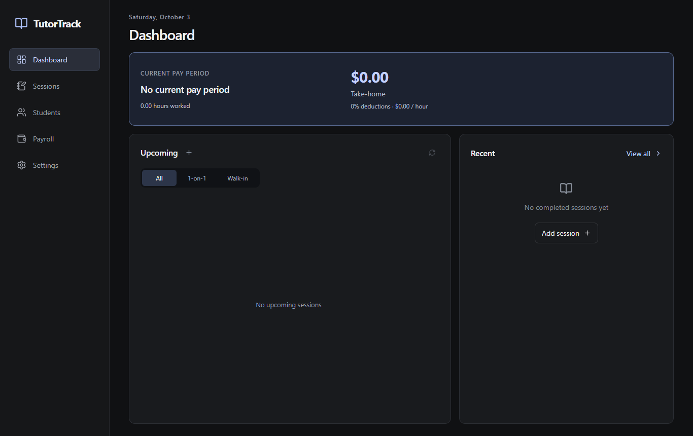

# TutorTrack

An offline desktop app for tracking tutoring sessions, students and pay.

## Features

- Schedule sessions and manage students and courses.
- Track completed hours, upcoming sessions and estimated pay.
- Mark pay periods as paid and back up records to JSON.
- Import Google Calendar bookings with a [read-only sync button](docs/GOOGLE-CALENDAR.md).

## Built with

React · TypeScript · Electron · Vite · Tailwind CSS · Dexie · Zod · Vitest
